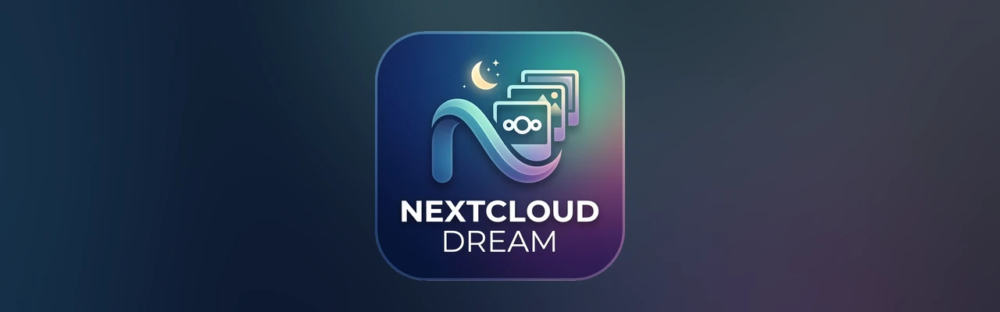

<p align="center"></p>

# Nextcloud Dream

[](https://github.com/midiland/nextcloud-dream/releases/latest/download/nextcloud-dream.apk)

A screensaver for **Android TV** that shows a slideshow of the photos in a folder on your **Nextcloud** server.

- Cross-fade between photos. Display time is configurable (20 s by default).
- **Framing adapted to each photo:**
  - landscape photos fill the screen;
  - portrait and square photos are shown in full, over a blurred background taken from the photo itself.
- **Date taken and location** in the bottom-left corner ("31 October 2022 — Paris, France"). Both come from the photo's EXIF data; the place name is computed from the GPS coordinates.
- Current time and date in the bottom-right corner. The clock shifts slightly every minute to prevent burn-in on OLED screens.
- Random order, without a photo coming back too soon.
- **No limit on the number of photos:** they are downloaded on the fly, as previews resized by the server.
- **Keeps working offline** thanks to a fallback cache of the most recently shown photos.
- The Nextcloud app password is encrypted with a key kept in the Android Keystore.

Tested on a Mi Box S (Android 9) and an Android TV emulator (Android 12). Requires **Android 9** or later.

> The app is available in **English** and **French**, following the device language (English for any other language).

---

## How it works (hybrid mode)

```
                         ┌──────────── every 6 h (SyncWorker) ─────────────────┐
                         │  1. list of photos (WebDAV PROPFIND)                 │
Nextcloud ◄──────────────┤  2. date + GPS: reads the first KB of each JPEG     │──► local index
                         │     (EXIF), place name via the Android geocoder      │    (photo_index.json)
                         │  3. preloads 20 photos into the cache                 │
                         └──────────────────────────────────────────────────────┘

                         ┌──────────── while the screensaver runs ──────────────┐
Nextcloud ◄──────────────┤  server-resized preview (~0.5-1 MB), downloaded      │──► fallback cache
   (core/preview)        │  while the previous photo is on screen:              │    (50 MB, oldest
                         │  always 1 photo ahead                                │     evicted first)
                         └──────────────────────────────────────────────────────┘
```

- **Startup:** the screensaver reads the local index, so no network access is needed. On the very first run, it only waits for the photo list to be fetched.
- **During the slideshow:** for each photo, the screensaver uses the cached copy if there is one; otherwise it asks Nextcloud for a **resized preview**. If the server can't generate one (for example HEIC without a dedicated module), it downloads the original and resizes it on the device.
- **Server unreachable:** the slideshow continues with the photos in the fallback cache, and retries the network every 5 minutes.
- **Storage almost full:** the device is never filled up; downloads stop when less than 30 MB of usable space remains.

---

## 1. Prepare Nextcloud

1. Create a folder for the screensaver photos, for example `/Photos/ScreenSaver`. Subfolders are included too.
2. Create an **app password**. Do not use your main password.
   - In Nextcloud: **Personal settings → Security → Devices & sessions**.
   - Enter a name such as "Mi Box", then click **Create new app password**.
   - Write down the generated password. You can revoke it at any time.

Supported formats: JPG, JPEG, PNG, HEIC/HEIF, WebP.

> The server must be reachable over **HTTPS with a valid certificate**. Plain HTTP and self-signed certificates are not supported yet.
>
> If the folder is **shared** with the account used on the TV box, it often appears at a different path for that account (at the root by default). The **Test connection** button lets you check.

## 2. Get the APK

The quickest way is to download the APK from the latest release and skip to step 3. The asset is always
named `nextcloud-dream.apk`, so this URL always points at the newest version:

```bash
curl -LO https://github.com/midiland/nextcloud-dream/releases/latest/download/nextcloud-dream.apk
```

The [releases page](https://github.com/midiland/nextcloud-dream/releases/latest) lists the version number and
the release notes.

### Building it yourself

Requirement: [Android Studio](https://developer.android.com/studio), which provides the JDK and the Android SDK.

```bash
export JAVA_HOME="/Applications/Android Studio.app/Contents/jbr/Contents/Home"   # macOS
./gradlew assembleRelease     # app/build/outputs/apk/release/app-release.apk (~2 MB)
./gradlew assembleDebug       # app/build/outputs/apk/debug/app-debug.apk (verbose logs, cache inspection)
```

| | Release | Debug |
|---|---|---|
| Size | ~2 MB (R8-optimized) | ~15-25 MB |
| Logs | info, warnings, errors (tag `NextcloudDream`) | everything (tag = class name) |
| File inspection via `run-as` | ❌ | ✅ |
| Use for | the TV box (limited storage) | the emulator, debugging |

Both builds are signed with the same key, so you can switch between them with `adb install -r` without losing the configuration.

## 3. Install on the TV box

### Enable ADB debugging

1. Go to **Settings → Device Preferences → About**.
2. Click **"Build" 7 times**: a "You are now a developer" message appears.
3. Go back to **Device Preferences → Developer options**.
4. Turn on **USB debugging**.
5. Note the box's IP address in **Settings → Network & Internet**.

### Install

```bash
adb connect 192.168.1.XX:5555      # accept the authorization prompt shown on the TV
adb install -r nextcloud-dream.apk                         # APK downloaded from the release
adb install -r app/build/outputs/apk/release/app-release.apk   # APK built locally
```

## 4. Configure

1. Open **Nextcloud Dream** from the home screen, or with `adb shell am start -n fr.midiland.nextclouddream/.MainActivity`.
2. Fill in the fields:
   - server URL
   - username
   - app password
   - folder
   - display time, refresh interval, fallback cache size, clock, date and location
3. Click **Test connection**: the number of photos found should be displayed.
4. Click **Save and sync**.

## 5. Enable the screensaver

1. Go to **Settings → Device Preferences → Screen saver**.
2. Choose **Photos Nextcloud**.
3. Set the start delay.

If the option doesn't appear, see [Selecting and starting the screensaver](#selecting-and-starting-the-screensaver).

---

## Testing and maintenance

Each task below shows the **on-TV method** (remote control, Android TV menus) when one exists, then the **ADB command**. Menu names are those of Android TV 9 in English; they may differ slightly depending on the device.

### ADB setup

Add the tools to your `PATH`, for example in `~/.zshrc`:

```bash
export ANDROID_HOME="$HOME/Library/Android/sdk"
export PATH="$ANDROID_HOME/platform-tools:$ANDROID_HOME/emulator:$PATH"
```

**Several devices connected** (emulator + TV box): add `-s <device>` to every command, for example `adb -s 192.168.1.XX:5555 shell …` or `adb -s emulator-5554 shell …`. `adb devices` lists the devices.

### Android TV emulator

On an Apple Silicon Mac, Android TV 9 (API 28) images only exist for x86. Use an **API 30 or later image, arm64**.

- **🖥️ In Android Studio:**
  1. Open **Device Manager**, then **+**, then **Create Virtual Device**.
  2. Choose the **TV** category, then **Television (1080p)**.
  3. Pick an **Android TV** system image, **arm64-v8a**, API 31.
- **⌨️ With the command line:**

  ```bash
  sdkmanager "system-images;android-31;android-tv;arm64-v8a"
  avdmanager create avd -n Android_TV_1080p_API31 -k "system-images;android-31;android-tv;arm64-v8a" -d tv_1080p
  emulator -avd Android_TV_1080p_API31
  ```

> To use the Mac keyboard in the emulator, set `hw.keyboard = yes` in `~/.android/avd/Android_TV_1080p_API31.avd/config.ini` (or in Android Studio: **Device Manager → ✏️ Edit → Show Advanced Settings → Enable keyboard input**), then restart the emulator.

### Installing the app

- **📺 On the TV, without a computer:**
  - Copy the APK to a USB stick and open it with a file manager on the box.
  - Or download it with the **Downloader** app.
  - Android will ask you to allow installs from that app: **Settings → Device Preferences → Security & restrictions → Unknown sources**.
- **⌨️ With ADB:**

  ```bash
  adb install -r app/build/outputs/apk/release/app-release.apk
  ```

### Opening the configuration screen

- **📺 On the TV:**
  - From the home screen, open **Apps** (or the app row) and select **Nextcloud Dream**.
  - Or go to **Settings → Device Preferences → Screen saver** and use the screensaver's settings entry.
- **⌨️ With ADB:**

  ```bash
  adb shell am start -n fr.midiland.nextclouddream/.MainActivity
  ```

### Typing text into a field

- **📺 On the TV:**
  - Select the field with the remote and type with the on-screen keyboard.
  - Much faster: the **Google TV** or **Android TV Remote** app on your phone, connected to the box, lets you type with your phone's keyboard. Handy for the URL and the app password.
- **⌨️ With ADB:** first select the field, then:

  ```bash
  adb shell input text "https://cloud.example.com"  # space = %s; use single quotes for & $ ( !
  adb shell input keyevent KEYCODE_TAB              # next field
  adb shell input keyevent KEYCODE_ENTER            # confirm
  ```

### Selecting and starting the screensaver

- **📺 On the TV:**
  1. Go to **Settings → Device Preferences → Screen saver**.
  2. **Screen saver**: choose **Photos Nextcloud**.
  3. **When to start**: set the inactivity delay.
  4. **Start now**: starts it immediately.

  Some Android TV / Google TV versions hide third-party screensavers. Use ADB in that case.
- **⌨️ With ADB:**

  ```bash
  # Make it the active screensaver
  adb shell settings put secure screensaver_enabled 1
  adb shell settings put secure screensaver_components fr.midiland.nextclouddream/.dream.NextcloudDreamService

  # Start it now — emulator
  adb shell am start -n com.android.systemui/.Somnambulator

  # Start it now — Mi Box (Somnambulator does nothing there): use the TV settings "sleep" action
  adb shell am start -a com.google.android.pano.action.SLEEP -n com.android.tv.settings/.device.display.daydream.DaydreamVoiceAction

  # Check that it is running
  adb shell dumpsys dreams | grep mCurrentDreamName
  ```

Press any key on the remote to exit the screensaver.

### Going back to Google's screensaver (Backdrop / Ambient mode)

- **📺 On the TV:** **Settings → Device Preferences → Screen saver → Screen saver**, then choose **Backdrop** (sometimes called "Ambient mode").
- **⌨️ With ADB:**

  ```bash
  adb shell settings put secure screensaver_components com.google.android.backdrop/com.google.android.backdrop.Backdrop
  ```

### Following the logs

- **📺 On the TV:** not available. The configuration screen only shows the result of the last test or sync.
- **⌨️ With ADB:**

  ```bash
  adb logcat -s NextcloudDream:V                              # release build
  adb logcat --pid=$(adb shell pidof fr.midiland.nextclouddream)      # debug build (everything)
  ```

  Example at startup (log messages are in French):

  ```
  Économiseur démarré
  WebDAV : 18 image(s) trouvée(s) dans /Photos/ScreenSaver
  Synchro : 18 photo(s), 18 métadonnée(s) lue(s), 16 préchargée(s), 18 en cache
  Photo affichée : 260e33d4….jpg (entière)
  ```

### Screenshot

- **📺 On the TV:** Android TV has no built-in screenshot shortcut. In the emulator, use the 📷 button in the side toolbar.
- **⌨️ With ADB:**

  ```bash
  adb exec-out screencap -p > screenshot.png
  ```

### Inspecting the cache and the index

- **📺 On the TV:** only the total size is visible, in **Settings → Apps → Nextcloud Dream** (Storage).
- **⌨️ With ADB** (debug build only):

  ```bash
  adb shell "run-as fr.midiland.nextclouddream ls -la files/photos"            # fallback cache
  adb shell "run-as fr.midiland.nextclouddream cat files/photo_index.json"     # photo list + date/GPS/place
  ```

### Starting from scratch

- **📺 On the TV:** **Settings → Apps → Nextcloud Dream → Clear data**. This erases everything, configuration included. "Clear cache" there is not enough: the photos are kept in the app's data so that they survive Android's automatic cache cleanup.
- **⌨️ With ADB:**

  ```bash
  # Debug: clear the cache and the index, keep the configuration (full resync on next start)
  adb shell "run-as fr.midiland.nextclouddream sh -c 'rm -rf files/photos/* files/photo_index.json'"

  # Any build: erase all data, configuration included (same as "Clear data")
  adb shell pm clear fr.midiland.nextclouddream
  ```

### Simulating a network outage

- **📺 On the TV:** **Settings → Network & Internet → Wi-Fi** off, or unplug the Ethernet cable. Start the screensaver: it should continue from the fallback cache.
- **⌨️ With ADB** (emulator):

  ```bash
  adb shell svc wifi disable
  adb shell svc wifi enable
  ```

### Device storage

- **📺 On the TV:** **Settings → Device Preferences → Storage → Internal shared storage** shows free space and space used by apps.
- **⌨️ With ADB:**

  ```bash
  adb shell df -h /data
  ```

---

## Troubleshooting

| Problem | Solution |
|---|---|
| `Requested internal only, but not enough space` when installing | Storage is almost full. Android refuses any install below ~5% free space. Free up some space. |
| Logs: "Stockage de l'appareil presque plein, téléchargements interrompus" (storage almost full, downloads stopped) | Same cause: usable space (excluding Android's reserve) is below 30 MB. |
| "Screensaver not configured" | Open the app and save the configuration. |
| "No photos available" | Server unreachable and fallback cache empty, or the folder is empty. Use **Test connection**. The app retries every 5 minutes. |
| Error 401 | Wrong username or app password. |
| Error 404 | Wrong folder path. It is relative to the account's root; a shared folder may have a different path. |
| No place name under the date | The photo has no GPS coordinates (camera without GPS), or the geocoder was unreachable: it retries at the next sync. |
| Logs: "Aperçu indisponible … téléchargement de l'original" (preview unavailable, downloading original) | The server doesn't generate previews for this format (often HEIC). It still works, just more slowly. |
| `adb: more than one device/emulator` | Add `-s <device>` (see `adb devices`). |
| `adb: command not found` | Add `platform-tools` to your `PATH` (see above). |

---

## Code structure

```
app/src/main/java/fr/midiland/nextclouddream/
├── NextcloudDreamApp.kt             initialization (logs, image loader, periodic sync)
├── AppContainer.kt                  process-wide instances (settings, repository)
├── MainActivity.kt                  configuration screen
├── dream/
│   ├── NextcloudDreamService.kt     the screensaver: lifecycle, display, 1 photo ahead
│   ├── SlideSource.kt               next photo: online, or from the fallback cache when offline
│   └── PhotoPlaylist.kt             random order without close repeats
├── ui/
│   ├── SlideshowView.kt             display, framing, cross-fade
│   └── BlurredBackground.kt         blurred background for portrait photos
├── photos/
│   ├── PhotoRepository.kt           index sync, on-the-fly download, fallback logic
│   ├── PhotoSource.kt               what the screensaver needs from the repository
│   ├── IndexedPhoto.kt, PhotoMetadata.kt, FetchResult.kt   models
├── remote/
│   ├── NextcloudWebDavClient.kt     WebDAV, Nextcloud previews, partial reads
│   ├── MultistatusParser.kt         PROPFIND response parsing
│   ├── ExifReader.kt                date taken + GPS from EXIF
│   └── PlaceResolver.kt             GPS coordinates → place name
├── storage/
│   ├── PhotoCacheManager.kt         fallback cache (LRU, size-capped, atomic writes)
│   └── PhotoIndexStore.kt           local photo index (JSON, AtomicFile)
├── image/
│   ├── Framing.kt                   crop vs. whole-image rule
│   └── ImageResizer.kt              on-device resizing (when no server preview)
├── settings/
│   ├── SettingsManager.kt           settings (app password encrypted)
│   └── KeystoreCipher.kt            AES-GCM with an Android Keystore key
└── worker/SyncWorker.kt             periodic background sync
```

The settings screen checks the GitHub releases when it opens, and offers a one-tap update when a newer version exists. The APK is handed to the system installer, which asks for confirmation — Android also requires you to allow Nextcloud Dream to install apps, once. An update only installs if it carries the same signature as the version already on the device.

Unit tests (JVM, no emulator needed) are in `app/src/test`: `./gradlew testDebugUnitTest`. They also run in CI before each release build.

Coverage: `./gradlew jacocoTestReport` writes an HTML report to `app/build/reports/jacoco/jacocoTestReport/html/index.html`. It covers the JVM-testable code only — the screensaver UI, the settings screen and the sync worker need a device, so they weigh on the figure without being reachable from these tests.

Dependencies: Coil, OkHttp, WorkManager, ExifInterface, Coroutines, Timber.

Code comments are in French.

## Releases (GitHub Actions)

Each version tag pushed to GitHub triggers `.github/workflows/release.yml`, which builds the release APK and attaches it to a new **GitHub Release**.

### Publishing a version

```bash
git tag V1.00.00 && git push origin V1.00.00
```

The release then contains the APK as `nextcloud-dream.apk`. The name carries no version on purpose: that is
what makes `releases/latest/download/nextcloud-dream.apk` a permanent link to the newest release. The version
itself is in the release title, in the tag, and in the app (`adb shell dumpsys package fr.midiland.nextclouddream | grep versionName`).

### Version numbers

The tag sets the app version. The accepted format is `Vxx.xxx.xxx`: 1 or 2 digits for the major, 1 to 3 for the minor and the patch, with an optional lowercase `v`. Any other tag fails the build.

| Tag | `versionName` | `versionCode` |
|---|---|---|
| `V1.02.03` | `1.02.03` | `1002003` |
| `V1.10.00` | `1.10.00` | `1010000` |
| `V12.345.678` | `12.345.678` | `12345678` |
| none (local build) | `0.0.0-dev` | `1` |

`versionCode` is `MMmmmppp`, so it grows with the version and each release installs as an update over the previous one. The highest possible value, `99999999` for `V99.999.999`, stays well below the maximum an Android `versionCode` accepts.

To build a specific version locally: `./gradlew assembleRelease -PappVersion=V1.02.03`.

### Signing

Android only installs an update if it is signed with the same key as the installed app. Set up a signing key once, before the first tag; otherwise every CI build gets a different temporary key and the app has to be uninstalled before each update.

1. Create the key and copy it in base64:

   ```bash
   keytool -genkeypair -keystore release.keystore -alias nextcloud-dream -keyalg RSA -keysize 4096 -validity 10000
   base64 -i release.keystore | pbcopy   # macOS
   ```

2. In the GitHub repository, open **Settings → Secrets and variables → Actions** and add:

   | Secret | Value |
   |---|---|
   | `SIGNING_KEYSTORE_BASE64` | the base64 content copied above |
   | `SIGNING_STORE_PASSWORD` | the keystore password |
   | `SIGNING_KEY_ALIAS` | `nextcloud-dream` |
   | `SIGNING_KEY_PASSWORD` | the key password (by default, the same as the keystore password) |

3. Store `release.keystore` and its password somewhere safe, outside the repository. If they are lost, the app can no longer be updated in place.

APKs built locally without these secrets are signed with your debug key. Moving from a local build to a CI build (or back) therefore requires `adb uninstall fr.midiland.nextclouddream` first.

The workflow runs on `ubuntu-latest`, which ships with the Android SDK; it only installs JDK 17.

## License

Copyright 2026 Midiland

Licensed under the [Apache License, Version 2.0](LICENSE). You may not use this project except in compliance with the License. Unless required by applicable law or agreed to in writing, software distributed under the License is distributed on an "AS IS" BASIS, WITHOUT WARRANTIES OR CONDITIONS OF ANY KIND, either express or implied.
